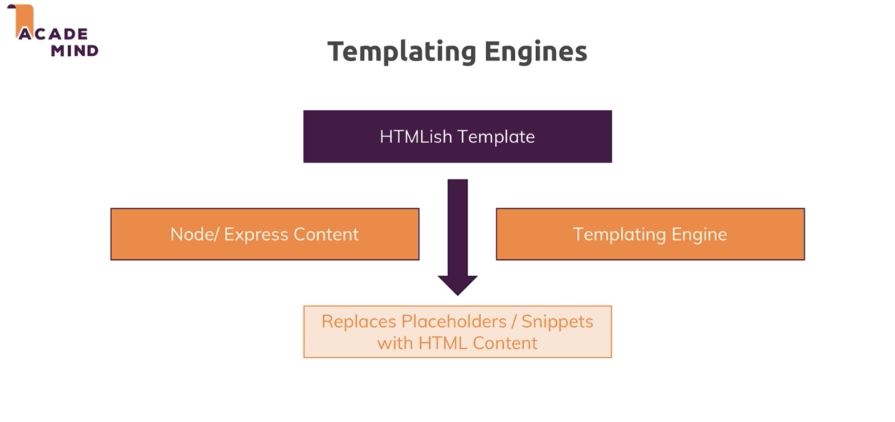
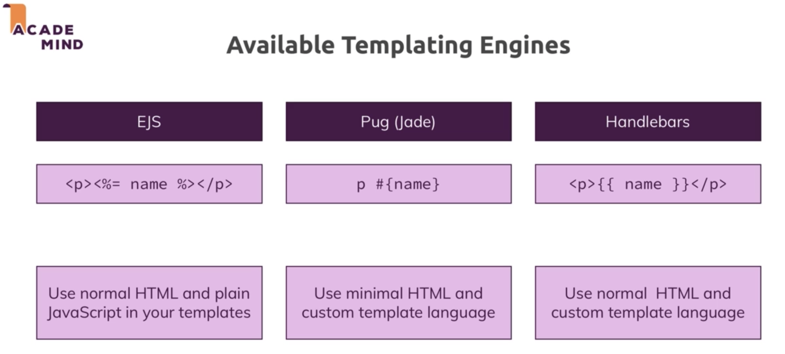

# Templating Engines

## [Rendering data (views)](https://developer.mozilla.org/en-US/docs/Learn/Server-side/Express_Nodejs/Introduction#rendering_data_views)

Template engines (referred to as "view engines" by _Express_)

Express has support for [a number of template engines](https://github.com/expressjs/express/wiki#template-engines), and there is a useful comparison of the more popular engines here: [Comparing JavaScript Templating Engines: Jade, Mustache, Dust and More](https://strongloop.com/strongblog/compare-javascript-templates-jade-mustache-dust/).

In your application settings code you set the template engine to use and the location where Express should look for templates using the 'views' and 'view engines' settings, as shown below (you will also have to install the package containing your template library too!)

```js
const express = require('express');
const path = require('path');
const app = express();

// Set directory to contain the templates ('views')
app.set('views', path.join(__dirname, 'views'));

// Set view engine to use, in this case 'some_template_engine_name'
app.set('view engine', 'some_template_engine_name');
```

you would call `Response.render()` in a route handler function to create and send the HTML response:

```
app.get('/', function(req, res) {
  res.render('index', { title: 'About dogs', message: 'Dogs rock!' });
});
```

For more information see [Using template engines with Express](http://expressjs.com/en/guide/using-template-engines.html) (Express docs).

---

## Templating Engines



Dynamically genetated HTML-File

- EJS
- Pug(Jade)
- Handlebars



---

```
 npm i ejs pug express-handlebars
```

---

## Workflow

- install the templating engine
- register `app.set('view engine', 'ejs');`
- define folder or use default: `app.set('views', 'views')`
- use `res.render('page', {data-object})`
- in the template you can include the data, do contitional rendering and loops

---

## Pug

`app.set()`

http://expressjs.com/en/api.html#app.set

tell express to use pg

```js
app.set('view engine', 'pug');
```

definne the folder, where the templates are:

```js
app.set('views', 'views'); // -> /views is the default folder, so this is not needed
```

create pug-file `shop.pug`

```pug
doctype html
html(lang="en")
    head
        meta(charset="UTF-8")
        meta(http-equiv="X-UA-Compatible", content="IE=edge")
        meta(name="viewport", content="width=device-width, initial-scale=1.0")
        title My Shop
        link(href="/css/main.css", rel="stylesheet")
        link(href="/css/product.css", rel="stylesheet")
    body
        header.main-header
            nav.main-header__nav
                ul.main-header__item-list
                    li.main-header__item
                        a.active(href="/") Shop
                    li.main-header__item
                        a(href="/admin/add-product") Add Product

```

- indentation matters!
- `header.main-header` is a `<header class="main-header">`
- attributes are inside `()`
- text seperated with whitespace

to sende it use (no need to define a path)

```js
res.render('shop');
```

pass dynamic data:

```js
res.render('shop', { prod: products, docTitle: 'Shop' });
```

##### Templating Syntax

output text:

```
#{}
```

loop though array

```
each product in prods
```

```
 body
        header.main-header
            nav.main-header__nav
                ul.main-header__item-list
                    li.main-header__item
                        a.active(href="/") Shop
                    li.main-header__item
                        a(href="/admin/add-product") Add Product
        main
            .grid
                each product in prods
                    article.card.product-item
                        header.card__header
                            h1.product__title #{product.title}
                        .card__image
                            img(src="...", alt="A Book")
                        .card__content
                            h2.product__price $19.99
                            p.product__description A book!
                        .card__actions
                            button.btn Add to Cart
```

conditional check:

```
if prods.length > 0
		.grid
				each product in prods
        		...
else
		h1 no product
```

Want to learn more about Pug? Check out their official docs: https://pugjs.org/api/getting-started.html

### Adding a layout

define **hooks**, where other pages cann extend the content

```
block styles
```

```pug
doctype html
html(lang="en")
    head
        meta(charset="UTF-8")
        meta(http-equiv="X-UA-Compatible", content="IE=edge")
        meta(name="viewport", content="width=device-width, initial-scale=1.0")
        title #{docTitle}
        link(href="/css/main.css", rel="stylesheet")
        block styles
    body
        header.main-header
            nav.main-header__nav
                ul.main-header__item-list
                    li.main-header__item
                        a(href="/") Shop
                    li.main-header__item
                        a(href="/admin/add-product") Add Product
        block content
```

in the page

```pug
extends layouts/main-layout.pug

block content
    h1 Page not Found
```

### Add Class to element

path is added as a prop

```pug
  body
        header.main-header
            nav.main-header__nav
                ul.main-header__item-list
                    li.main-header__item
                        a(class=(path==='/' ? 'active' : ''),href="/") Shop
                    li.main-header__item
                        a(class=(path==='/admin/add-product' ? 'active' : ''), href="/admin/add-product") Add Product
        block content

```

---

## Handlebars

pug is kind of built-in, express-handlebars is not

```js
const expressHbs = require('express-handlebars');

const app = express();

app.engine('handlebars', expressHbd()); // this is the ending of the files
app.set('view engine', 'handlebars');

// app.engine('hbs', expressHbd());
// app.set('view engine', 'hbs');
// => use .hbs-files
```

passing data into the template stays the same - object with the params

output dynamic data:

```
{{ ... }}
```

##### add logic

output content conditionally or in a loop

```
{{# }}
```

conditional rendering: -› (doesn't support full logic, just booleans)

```handlebars
{{#if hasProducts}}
	<div class="grid">
		<article class="card product-item">
			...
		</article>
	</div>
	{{else}}
		<h1>No products found!</h1>
{{/if}}
```

but this is also good: don' have too much logic in the template

##### loop

use `.this` to access the content

```handlebars
{{#each prods}}
	<article class="card product-item">
		<header class="card__header">
			<h1 class="product__title">{{this.title}}</h1>
		</header>

		<div class="card__content">
			<h2 class="product__price">$19.99</h2>
			<p class="product__description">A book!</p>
		</div>
		<div class="card__actions">
	 		<button class="btn">Add to Cart</button>
		</div>
	</article>
{{/each}}
```

#### Layout

...clumsy

---

## EJS

the best... no need to register it...

just use

```js
app.set('view engine', 'ejs');
```

to output something

```ejs
<%= ... %>
```

to run code:

```
<% write Javascript... %>
```

conditional:

```js
<% if(props.length > 0) { %>
	<div>
	...
	</div>
<% } %>
```

loop:

```ejs
<% for (let product of prods) { %>
	<article class="card product-item">
		<header class="card__header">
			<h1 class="product__title"><%= product.title %></h1>
		</header>
    ...
	</article>
<% } %>
```

##### Partials

(opposite of layouts)

eg `/includes` -folder

to render unescaped html code: `<%-`

```ejs
<%- include('./includes/head.ejs') %>
```

(relative path from the file you are in)

to add data: add an object

```ejs
<%- include('../includes/add-to-cart.ejs', {product: product}) %>
```

------

angela…:

https://ejs.co/

### Tags

- `<%` 'Scriptlet' tag, for control-flow, no output
- `<%_` ‘Whitespace Slurping’ Scriptlet tag, strips all whitespace before it
- `<%=` Outputs the value into the template (HTML escaped)
- `<%-` Outputs the unescaped value into the template
- `<%#` Comment tag, no execution, no output
- `<%%` Outputs a literal '<%'
- `%>` Plain ending tag
- `-%>` Trim-mode ('newline slurp') tag, trims following newline
- `_%>` ‘Whitespace Slurping’ ending tag, removes all whitespace after it

-> on a Line-by-Line-Basis!

------

### comments

`<%# comment %>`

```ejs
<%# comment %>
<%/* comment */%>
<% /* %>
  <div>
      <span>This will not be rendered</span>
      <% for(var i=0; i < data.length; i++) { %>
        <span>These won't be rendered either.</span>
      <% } %>
  </div>
<% */ %>
```

### Basic Setup

```js
let express = require('express');
let app = express();

app.set('view engine', 'ejs');

app.get('/', (req, res) => {
  res.render('index', {foo: 'FOO'});
});

app.listen(4000, () => console.log('Example app listening on port 4000!'));
```

(This assumes a `views` directory containing an `index.ejs` page.

------

```html
<input autocomplete="off">
```

------

###### css

```
  background-image: -webkit-linear-gradient(65deg, #A683E3 50%, #E4E9FD 50%);


input:checked+p {
  text-decoration: line-through;
  text-decoration-color: #A683E3;
}
-> alle p, die direkt nach gecheckter checkbox kommen
```

```
input[type="checkbox"] {
  margin: 20px;
}
-> 
```

```
::placeholder {
  color: grey;
  opacity: 1;
}
```

------

### Layouts/Partials

Teile wiederverwenden

```ejs
<%- include('header') %>

oder

<%- include('./partials/header') %>
```


---

## Useful resources

- Pug Docs: https://pugjs.org/api/getting-started.html
- Handlebars Docs: https://handlebarsjs.com/
- EJS Docs: http://ejs.co/#docs

---
