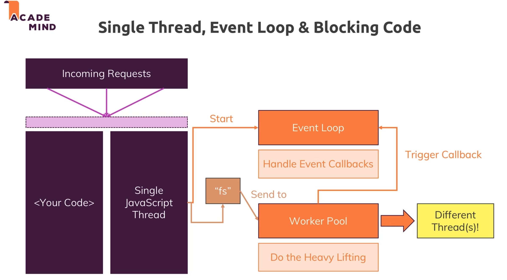
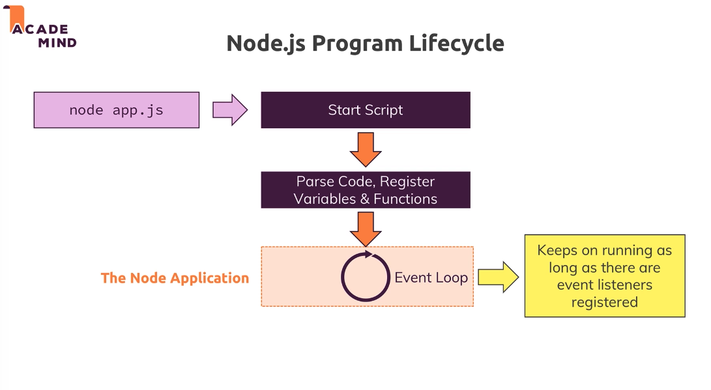

# Node Event-Driven Architecture

Node uses an Event-Driven Architecture

- Node.js runs non-blocking JS code and uses an event driven cone ("Event Loop") for runnig your logic
- A Node program exits as soon as there is no more work to do
- Note: the `createServer()` event never finishes by default

## Event Emiter

- We can make our own instances of the `EventEmitter` class and we can subscribe to listen for named events with the `.on()` method and emit events with the `.emit()` method.

```js
// Require in the 'events' core module
let events = require('events');

// Create an instance of the EventEmitter class
let myEmitter = new events.EventEmitter();
```

Each event emitter instance has an `.on()` method which assigns a _listener_ callback function to a named event.

`.on(event, callbackFunction)`

`.emit(eventName, data)` method announces that named event has occurred.

```js
let newUserListener = (data) => {
  console.log(`We have a new user: ${data}.`);
};

// Assign the newUserListener function as the listener callback for 'new user' events
myEmitter.on('new user', newUserListener);

// Emit a 'new user' event
myEmitter.emit('new user', 'Lily Pad'); //newUserListener will be invoked with 'Lily Pad'
```

## Event-Loop

#### Node.js uses only one single Thread

- Node uses an event loop which enables asynchronous actions to be handled in a non-blocking way by adding callback functions to a queue of tasks to be executed when the callstack is empty.

- keeps on running as long as there are event listener registered.

- single threaded


`process.exit` ends the app

#### Event Loop

- started, when Node.js starts
- Handles Event Callbacks

checks

- due Timer
- pending callbacks
- if there are too many open callbacks, it will postpone those
- close event-callbacks

process.exit refs==0

refs is a counter for the open callbacks





---

## Worker Pool

- operation that take long, are send to the Worker Pool
  -> does the heavy lifting

---

## Event Driven Code Execution

-> pass a function (callback) that will be called, when the event happens

-> you register code, that will run sometime in the future

`writeFileSync` - synchronus Code -blocks Execution

`writeFile` - asynchronus -> contains a callback

```js
fs.writeFile('message.txt', message, (err) => {
  res.statusCode = 302;
  res.setHeader('Location', '/');
  return res.end();
});
```

-> code is not blocked. This should be used.
